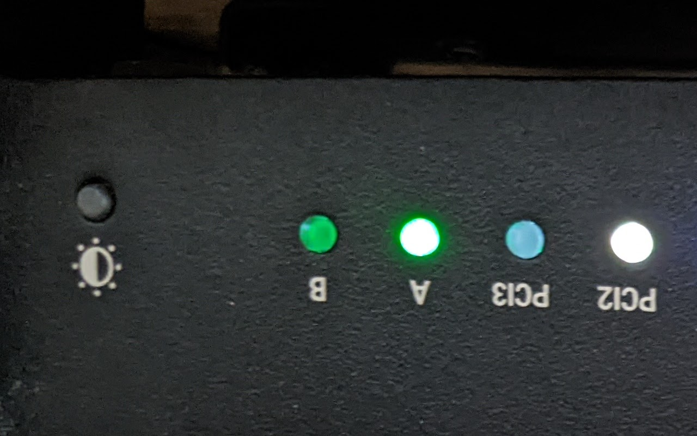

# Omnia Beanstalk LEDs

Project to make [Turris Omnia](https://www.turris.com/en/omnia/overview/) listen to a [Beanstalkd](https://beanstalkd.github.io/) and take instructions on what to do with it's LEDs.

Currently this project is able to control the user1 and user1 LEDs and can do so at any color, with them either on, off or flashing at various speeds.

Please see below for video:

https://user-images.githubusercontent.com/3470771/190434442-9dabfc86-d895-4eac-8233-cbc7c2ab186c.mp4

This has responded to the message:

```
LED=usr1;STATUS=3;COLOR=255 0 0
LED=usr2;STATUS=2;COLOR=0 255 255
```

You could also set the lights to be on/off and static:



Which was done using the following message

```
LED=usr1;STATUS=1;COLOR=0 255 0
LED=usr2;STATUS=0;COLOR=0 0 255
```

## Installation

### Dependency Greenstalk

Omnia Beanstalk LEDs uses [Greestalk](https://github.com/justinmayhew/greenstalk) to communicate with Beanstalk.

I found, that on the Omnia I couldn't initilize a Virtual Environment for PIP and I didn't fancy / test doing a system wide install. I therefore just copied [the source code](https://github.com/justinmayhew/greenstalk/blob/main/src/greenstalk/__init__.py) to `greenstalk.py` and it works wonderfully.

### Configuration

Some languages want you to store configuration in files, sometimes this is useful but I'm not a fan. As someone who has to run a whole lot of different things in production, I much prefer to follow the [12 Factor App](https://12factor.net/config) and use Environmental Variables. This Application uses the following Environmental Variables:

 * `OMNIA_BEANSTALK_LEDS_BEANSTALK_HOST` - The hostname of your Beanstalkd server (default `localhost` )
 * `OMNIA_BEANSTALK_LEDS_BEANSTALK_PORT` - The port of your Beanstalkd server (default `11300` )
 * `OMNIA_BEANSTALK_LEDS_BEANSTALK_TUBE` - The tube where messages are placed (default `status` )
 * `OMNIA_BEANSTALK_LEDS_BEANSTALK_TEST_ONLY` - If "1" write LED settings to files instead of changing physical LEDS

### Starting Omnia Beanstalk LEDs when your Omnia boots

I've not done this yet! I'm now concentrating on the thing that adds messages to Beanstalkd.
